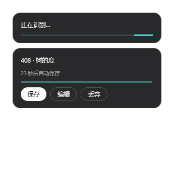
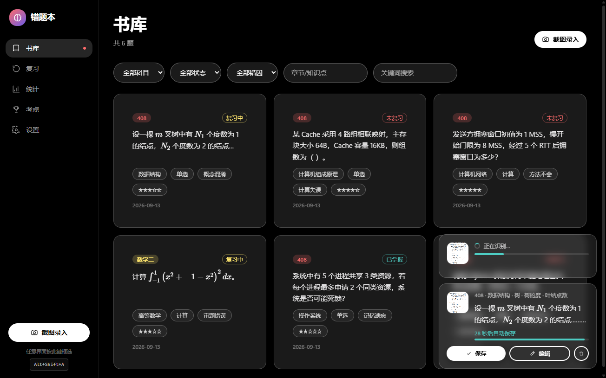
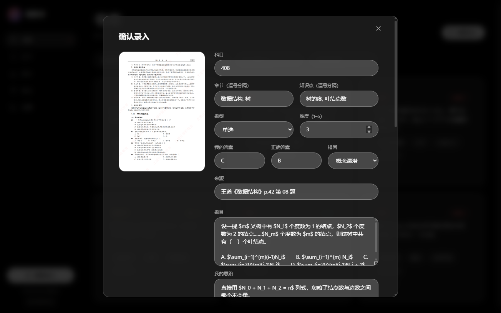
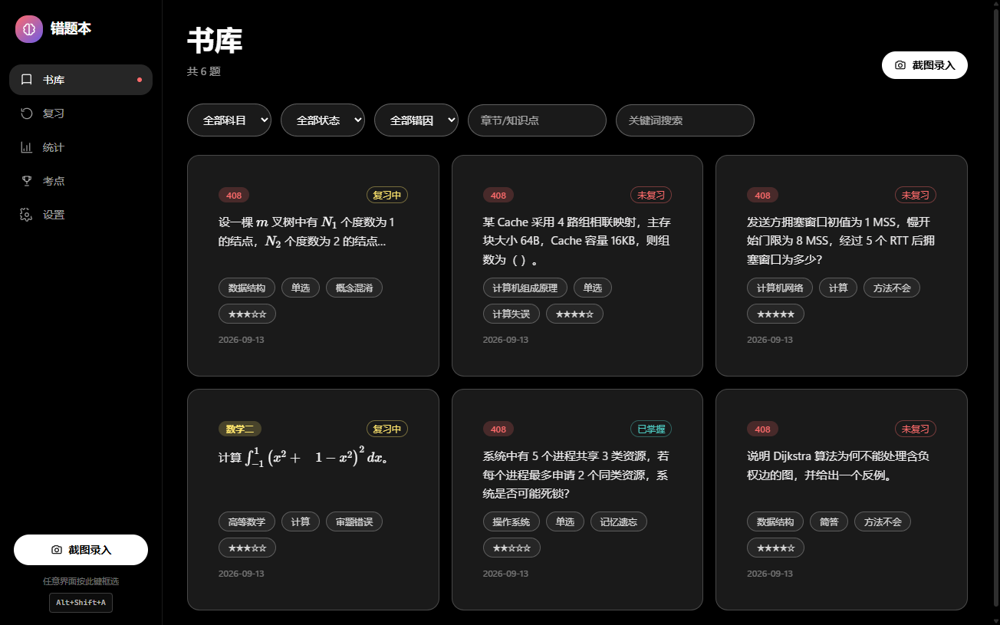
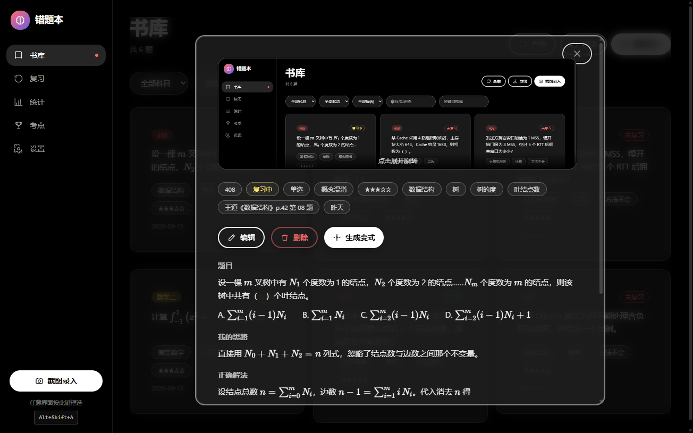
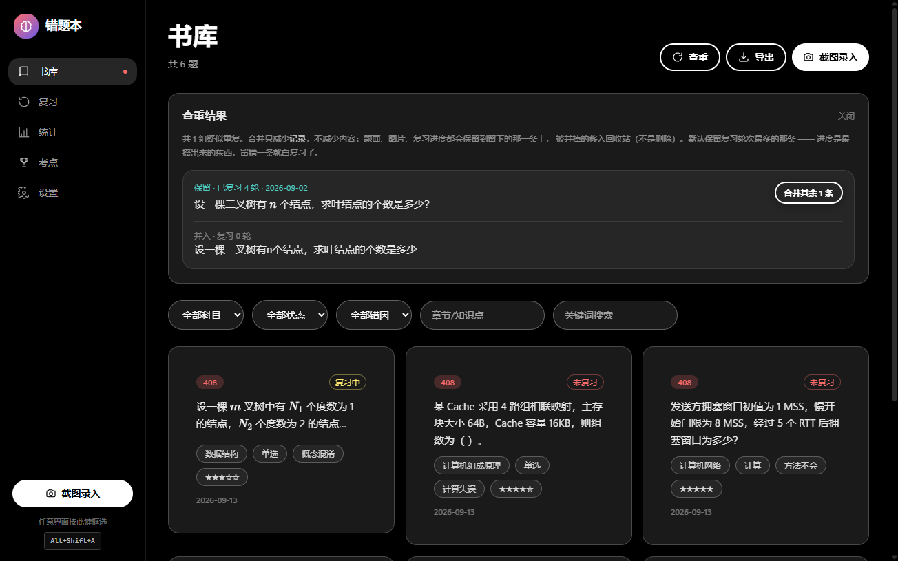
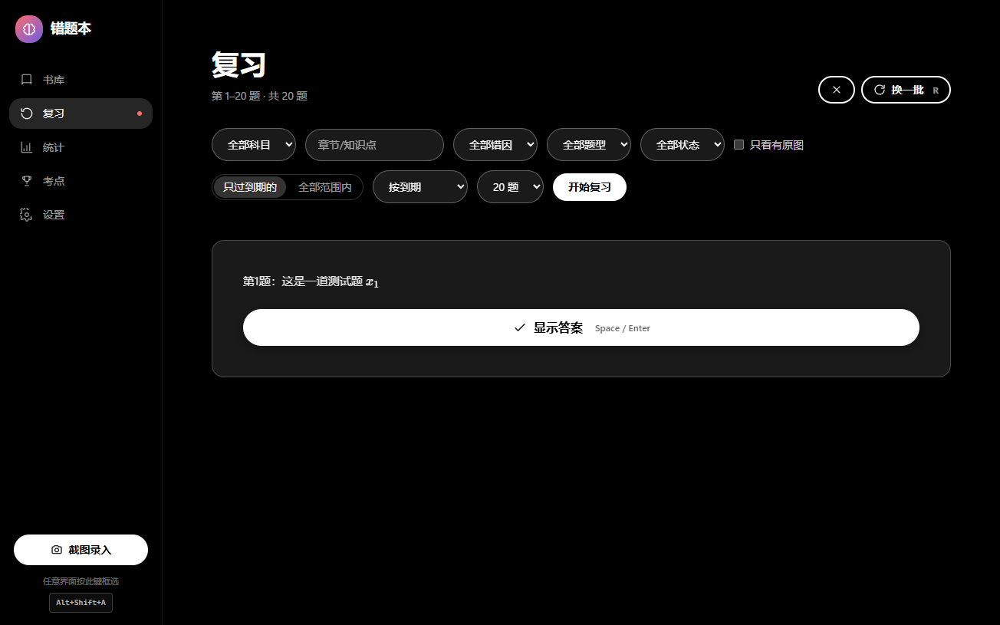
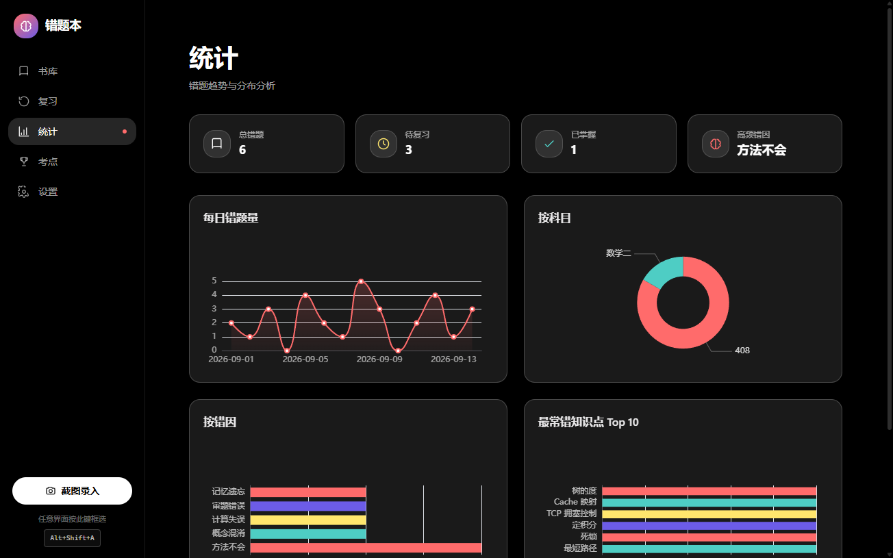
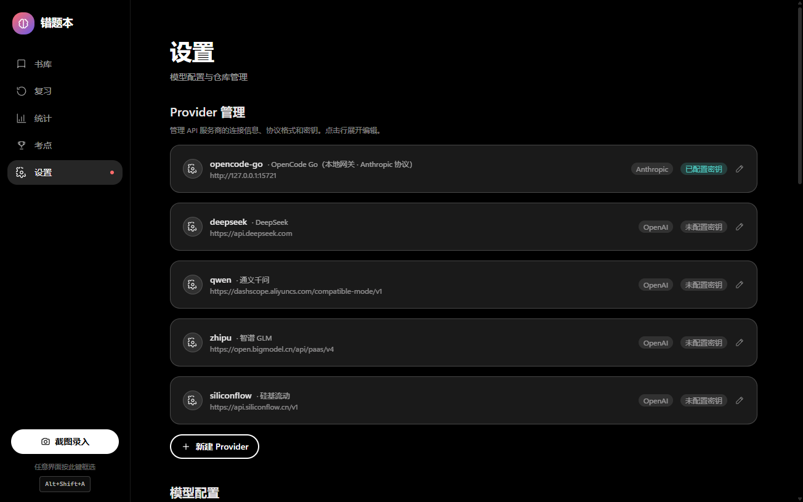

# MistakeBook · 错题本

> 截图即录，大模型理解，Markdown 沉淀 —— 一个给自己用的 AI 错题本。

按一下热键，框选一道做错的题，剩下的交给它：识别题干与选项、把公式转成 LaTeX、归档成一篇 Markdown，
再据此算出你该复习什么、薄弱在哪、哪些考点最值钱。

为 **2027 考研（22408：政治 / 英语二 / 数学二 / 408）** 而写，但科目、错因、考试日期全部可配置，
换成任何考试都能用。

---

## 界面

> 截图取自真实运行的应用，题目内容为示例数据。

### 录入：截图即录，识别完自动入库

按热键框选，剩下的全在后台跑，**不用打开软件**：屏幕右下角会出现一张独立通知卡片，
识别中 → `N 秒后自动保存` 倒计时 → `已保存 ✓`。它**不抢焦点**（你在看网课也不会被打断），
点「编辑」才会把软件窗口唤出来。



> 通知用的是深色卡片而不是玻璃拟态 —— 你读的 PDF 是白底，白字压在白玻璃上等于看不见。

打开软件时，右下角同样有一份浮层，多个识别任务会叠起来：



点「编辑」进入完整核对界面（结果已预填），模型自评置信度低于 75% 时会强制提醒复核：



### 书库

一题一卡，公式在这一层就已经渲染好了；可按科目 / 状态 / 错因 / 知识点筛选。



点开看详情 —— 原始截图默认只露一截，避免整页扫描件把题目和答案挤到折叠线以下：



同一道题截两次会存成两条，而两条会各自进复习队列、各自算进统计，
于是「这个考点我到底错过几次」虚高。右上角的**查重**会扫出互为重复的分组，
一键合并：保留复习轮次最多的那条，被并掉的移入回收站（**不是删除**）。
录入时也会实时提示「书库里已经有很像的题」，可以先合并再保存。



### 复习

**可以指定范围与参数的复习会话**，不是"把到期的都倒给你"：

- **范围**：科目 / 章节或知识点 / 错因 / 题型 / 状态 / 只看有原图
- **模式**：只过到期的（走间隔重复调度）、或忽略到期日**主动刷某一章**
- **顺序**：按到期 / 随机 / 按录入时间 / 按难度
- **一批 10 / 20 / 50 / 全部** —— 「换一批」真正取下一批，转到尾会绕回开头并提示
- 偏好会记住，下次打开还是你上次的范围
- 复习完了也不至于空着手：「**再做一遍上次这批**」会跟着偏好一起记下来（重启后仍在），
  今天没有到期的题时会明确告诉你「库里共 N 道，只是都没到期」并给一键切到「全部范围内」

先只给题干，答案藏在按钮后面 —— 否则没有自测的意义。全程键盘：`空格` 显示答案、`1`–`4` 评分、`←` 回上一题。



### 统计

分布与趋势。趋势是**按窗口对比**的 —— 默认「近 30 天 vs 前 30 天」，
少错 / 多练 / 少忘一律标绿。全是「有史以来」的数字在备考后期没有用，
你更想知道的是这周比上周好了还是差了；窗口天数在设置里改（7 / 14 / 30 / 90）。

外加由大模型读你自己的错题归纳出的「错因模式」。



### 设置

Provider 提为一等公民：每行直接显示 `baseUrl · 协议格式 · 密钥状态`，
`openai` / `anthropic` 两种协议都支持，厂商不设限。



---

## 为什么不用现成的

| | |
|---|---|
| 通用笔记软件 | 没有「从错题出发」的复习调度，也不认手写与公式 |
| 成熟的背单词 / 刷题 App | 是题库思维，不是**你自己的错题**思维 |
| 现成的开源错题本 | 截至 2026-09 检索，**没有**一个把「全局热键 + 视觉大模型 + Markdown 庫 + SQLite 索引」做进同一个桌面应用的 |

## 功能

**录入**
- 全局热键框选截图（默认 <kbd>Alt</kbd>+<kbd>Shift</kbd>+<kbd>A</kbd>）
- 视觉大模型识别：科目 / 章节 / 知识点 / 题型 / 难度 / 我的答案 / 正确答案 / 错因
- **公式一律转 LaTeX**（`$...$` 行内、`$$...$$` 块级）
- 模型置信度低时**强制人工核对**，不假装准确
- 原图永久保留 —— 换更好的模型可以重新识别
- **托盘常驻**：关窗口只是收进托盘，不退出（要随时按热键）。托盘菜单可直接「截图录入」

**沉淀**
- 一道错题一篇 Markdown，带 YAML frontmatter
- 图片单独存放，只增不改
- **文件是唯一真相源**，SQLite 只是可随时重建的索引

**复习**
- 到期队列 + 四档评分
- **带考试日期的调度**：间隔有上限，且绝不排到考试之后

**分析**
- 分布统计（科目 / 错因 / 知识点 / 每日新增）
- **周期对比**：近 N 天 vs 前 N 天的新增量、复习量、遗忘率 —— 看趋势而不是看总量
- **错因归纳**：让模型读你自己的错题，指出反复出错的模式
- **高频考点排行**：依据你的错题分布推算 —— 是「排优先级」，不是「押题」

**查重**
- 保存时提示「书库里已经有很像的题」，可并入而不是又存一条
- 书库整体查重，一键合并互为重复的分组（保留复习进度最多的那条）

**出题**
- 同知识点的变式题（换数值 / 换问法 / 反向问）

## 技术栈

Electron 44 · React 19 · TypeScript 7 · Tailwind CSS 4 · Vite 7 · KaTeX · ECharts · `node:sqlite`

**零原生依赖** —— SQLite 用 Electron 内置的 `node:sqlite`，不需要编译任何 native 模块。

## 存储结构

```
<仓库目录>/                      # 默认 <文档>/MistakeBook
├── mistakes/<科目>/<章节>/<id>.md
├── assets/<id>.png             # 原始截图
└── reviews.jsonl               # 复习事件（一行一次评分）
```

`<id>` 形如 `2026-09-13-a3f29c`（6 位随机 hex，生成时必须查重，否则会覆盖已有错题）。索引与配置放在 Electron 的 `userData` 目录，**API Key 用系统凭据库加密存储**。

`reviews.jsonl` 是**唯一无法只靠 Markdown 重建**的东西 —— Markdown 里留得下「上次复习」和「轮次」，
中间的过程一旦覆盖就没了。所以它和 Markdown 一样放在 vault 里当用户数据，重建索引时由它回填。

## 快速开始

```bash
npm install
npm run dev
```

打包：

```bash
npm run dist
```

## 配置模型

设置页支持 **全局默认 + 按功能覆盖**，每个功能可独立指定 provider 与模型：

| 功能 | 要求 |
|---|---|
| 采集识别 | **必须支持读图** |
| 错因分析 / 变式出题 / 考点排行 | 纯文本即可 |

**两种协议格式都支持，厂商不设限**：

只要对方是 OpenAI 兼容或 Anthropic 兼容，就能接。设置页里**预置的那几个只是示例，不是白名单**——
provider 的 id、baseUrl、协议格式、请求头全部自由填写，填错了调用时会明确报错，不会拦着你。

| 格式 | 聊天端点 | 模型列表端点 | 附带请求头 |
|---|---|---|---|
| `openai`（默认） | `baseUrl/chat/completions` | `baseUrl/models` | `Authorization: Bearer` |
| `anthropic` | `baseUrl/v1/messages` | `baseUrl/v1/models` | `x-api-key` + `anthropic-version` |

注意 `baseUrl` 要**按对方怎么挂端点**来填：有的厂商是 `https://api.deepseek.com`，有的是
`https://api.siliconflow.cn/v1`。另外可以给每个 provider 配**任意附加请求头**。
「拉取模型」按钮会向厂商要模型清单；对方不提供时（例如 OpenCode Go 只在 TUI 里列模型）
会明确告诉你手动填，而不是装作坏了。

内置预置：OpenCode Go / DeepSeek / 通义千问 / 智谱 GLM / 硅基流动（**仅作示例，不是白名单**）。

**默认四个功能都指向 OpenCode Go 的 `claude-sonnet-4-6`**，这样只配一把 key 就能全跑通。
那个看着不相干的模型名是**网关侧的别名**——OpenCode Go 按模型名决定路由，实测只有它会被路由到
支持读图的模型。换成别的 provider / 模型随时可在设置页改。

### OpenCode Go（本地网关）

OpenCode Go 是个 $10/月的订阅，走本地网关、**只支持 Anthropic 协议**，且**必须带
`x-opencode-session` 头**（已预置）。它的模型清单不通过 API 暴露。

⚠ **实测：模型名决定路由。** 填 `claude-sonnet-4-6` 会被路由到**支持读图**的视觉模型；
填别的名字（`gpt-4o`、`qwen-vl-max`、`glm-4v`…）会被路由到 `deepseek-v4-flash`，**它看不到图**。

### 自检

配置完不确定通不通，跑一行命令就能看到结论（不开窗口）：

```bash
npx electron . --selftest                  # 查配置 + 文本连通
npx electron . --selftest <图片路径>        # 再跑一次真实视觉识别
```

> **默认模型 `deepseek-flash`**：2026-09 实测其官方 API 支持图片输入。
> ⚠ 图片按尺寸折算 token，单张上限约 1024 —— 所以**截图要裁紧，只截一道题**。
> ⚠ 有的网关默认开思考模式，`max_tokens` 给小了会被推理吃光、拿不到正文（客户端已做重试）。

## 目录结构

```
src/
  main/        Electron 主进程
    capture/   全屏框选截图 + 全局热键
    llm/       OpenAI 兼容客户端、提示词、Zod 校验
    store/     vault 读写（frontmatter + Markdown + 图片）、SQLite 索引
    features/  错因分析 / 变式出题 / 考点排行
    review.ts  带考试日期的复习调度
  preload/     contextBridge 暴露的 window.api
  renderer/    React 界面
  shared/      主进程与渲染进程共用的类型与 IPC 契约
docs/
  specs/       设计文档
tests/         单元测试
```

## 开发

```bash
npm run dev        # 开发模式
npm test           # 单元测试
npm run typecheck  # 类型检查
```

架构与设计决策见 [`docs/specs/2026-09-13-mistakebook-design.md`](docs/specs/2026-09-13-mistakebook-design.md)。
变更历史见 [`CHANGELOG.md`](CHANGELOG.md)。

## 许可

MIT
